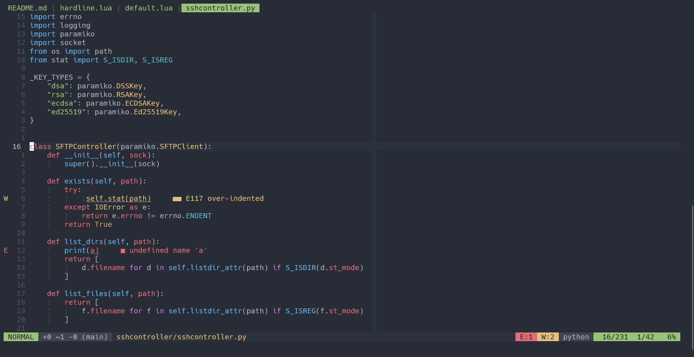

# nvim-hardline

A statusline / bufferline for Neovim written in Lua. It is inspired by
[vim-airline](https://github.com/vim-airline/vim-airline) but aims to
be as light and simple as possible.

_**Note**: this plugin is mainly for my own use. I won't add new
features/parts/themes if I don't need them. Feel free to submit PRs or fork the
plugin though._



## Installation
With [packer.nvim](https://github.com/wbthomason/packer.nvim):
```lua
use {'ojroques/nvim-hardline'}
```

With [paq-nvim](https://github.com/savq/paq-nvim):
```lua
paq {'ojroques/nvim-hardline'}
```

## Usage
In your *init.lua*:
```lua
require('hardline').setup {}
```

If you're using a *.vimrc* or *init.vim*:
```vim
lua require('hardline').setup {}
```

## Configuration
You can pass options to the `setup()` function. Here are all available options
with their default settings:
```lua
require('hardline').setup {
  bufferline = false,  -- enable bufferline
  theme = 'default',   -- change theme
  sections = {         -- define sections
    {class = 'mode', item = require('hardline.parts.mode').get_item},
    {class = 'high', item = require('hardline.parts.git').get_item, hide = 80},
    '%<',
    {class = 'med', item = require('hardline.parts.filename').get_item},
    {class = 'med', item ='%='},
    {class = 'low', item = require('hardline.parts.wordcount').get_item, hide = 80},
    {class = 'error', item = require('hardline.parts.lsp').get_error},
    {class = 'warning', item = require('hardline.parts.lsp').get_warning},
    {class = 'warning', item = require('hardline.parts.whitespace').get_item},
    {class = 'high', item = require('hardline.parts.filetype').get_item, hide = 80},
    {class = 'mode', item = require('hardline.parts.line').get_item},
  },
  bufferline_settings = {
    exclude_terminal = false,  -- don't show terminal buffers in bufferline
    show_index = false,        -- show buffer indexes (not the actual buffer numbers) in bufferline
  },
}
```

You can define your own sections using the `sections` list. Each element of
that list is a table with the following attributes:
* `class`: the section colorscheme. The following classes are currently
  available:
  * `mode`: change color based on the current mode.
  * `low`, `med`, `high`: colors for different levels of importance.
  * `bufferline`: colors for the bufferline.
  * `error`, `warning`: colors for the diagnostics of Neovim built-in LSP
    client.
* `item`: the actual text being displayed. Must be a string or a function
  returning a string.
* `hide`: threshold (in number of characters) below which the section will be
  hidden.

## Available section parts
| Part | Description |
|------|-------------|
| `cwd` | Current working directory |
| `filename` | Filename and file status (readonly, modified, ...) |
| `filetype` | Filetype |
| `git` | Git hunks (requires [vim-gitgutter](https://github.com/airblade/vim-gitgutter) / [vim-signify](https://github.com/mhinz/vim-signify) / [gitsigns.nvim](https://github.com/lewis6991/gitsigns.nvim)) and Git branch (requires [vim-fugitive](https://github.com/tpope/vim-fugitive) / [gina.vim](https://github.com/lambdalisue/gina.vim) / [vim-branchname](https://github.com/itchyny/vim-gitbranch) / [gitsigns.nvim](https://github.com/lewis6991/gitsigns.nvim)) |
| `line` | Line and column positions |
| `lsp` | Diagnostics from Neovim LSP client |
| `mode` | Current mode |
| `treesitter-context` | Current treesitter node (requires [nvim-gps](https://github.com/SmiteshP/nvim-gps)) |
| `whitespace` | Trailing whitespaces, mixed indent and Git conflict markers warnings |
| `wordcount` | Current word count (enabled only for [some filetypes](https://github.com/ojroques/nvim-hardline/blob/5fc738bb7991f7d7890be14e7a74a50e21f0bd81/lua/hardline/parts/wordcount.lua#L8-L19)) |

## License
[LICENSE](./LICENSE)
